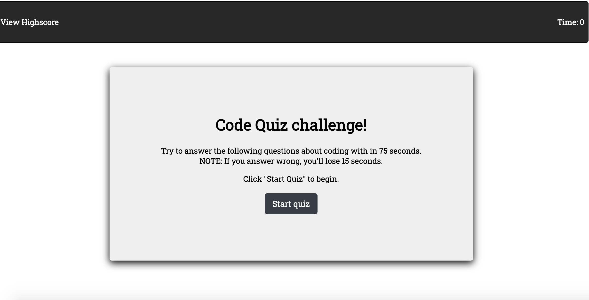
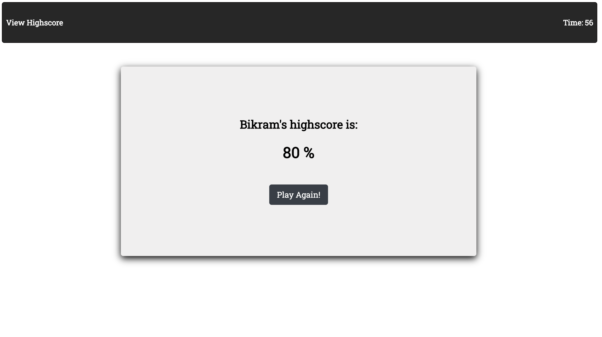

# Code Quiz

URL: (https://bikramshankhar.github.io/Code-quiz/)

* This is a code quiz which tests a user's knowledge of basic HTML, CSS, JavaScript concepts. I provided 5 questions to the user with 75 seconds as a count down. Every time the user gets a answer wrong, 15 seconds are deducted from the countdown clock. The application also uses local storage to store the user's score to the browser so that the users can view their pervious score by clicking View HighScore after they save their score.

